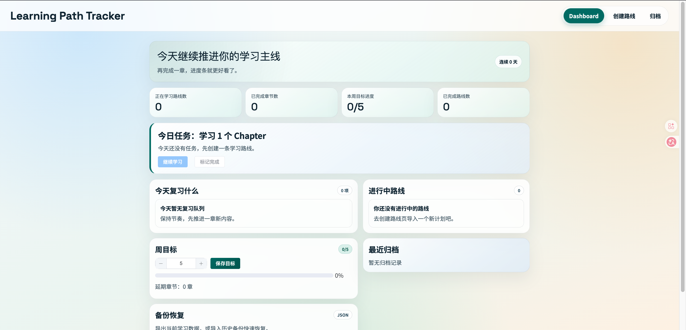

# Learning Path Tracker

面向技术学习的章节追踪面板（单用户本地版）。

## 页面预览



## 当前版本特性

- 手动输入章节清单（不做 GitHub README 自动解析）
- 默认按 `1 chapter/day` 创建学习路线
- Dashboard / 路线详情 / 归档管理
- 学习计时器（开始/暂停/结束自动回填时长）
- 复习队列（已完成章节可加入复习、复习完成打卡）
- 周目标与 JSON 备份恢复

## 更新日志

详见 [CHANGELOG.md](./CHANGELOG.md)。

## 项目结构

```text
backend/
  app/
  data/
frontend/
  src/
img/
```

## 本地启动

后端：

```bash
cd backend
python3 -m venv .venv
source .venv/bin/activate
pip install -r requirements.txt
uvicorn app.main:app --reload
```

前端：

```bash
cd frontend
npm install
npm run dev
```

- 前端：`http://127.0.0.1:5173`
- 后端 API：`http://127.0.0.1:8000/api`

## 清空数据（重置）

删除数据库文件后重启后端即可自动重建：

```bash
rm -f backend/data/learning_tracker.db
```
